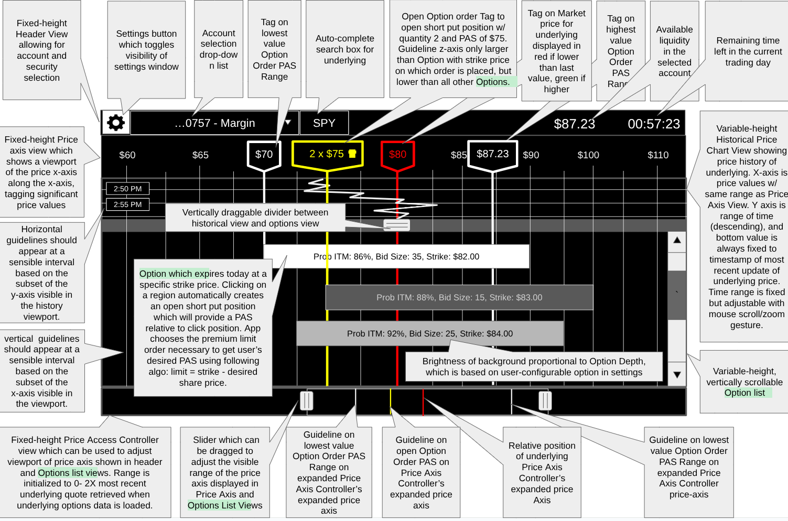
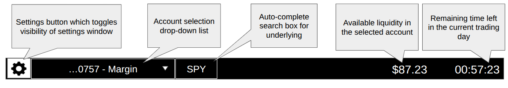
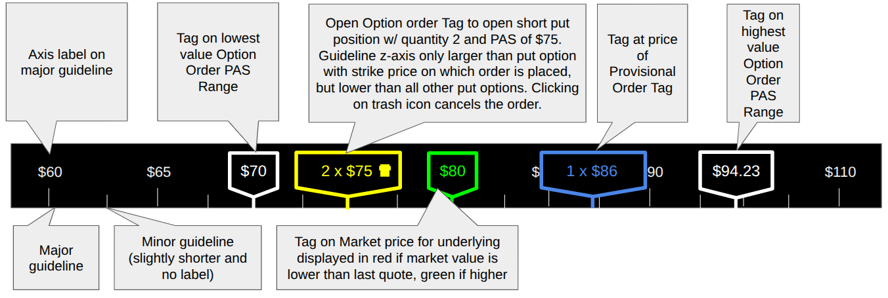
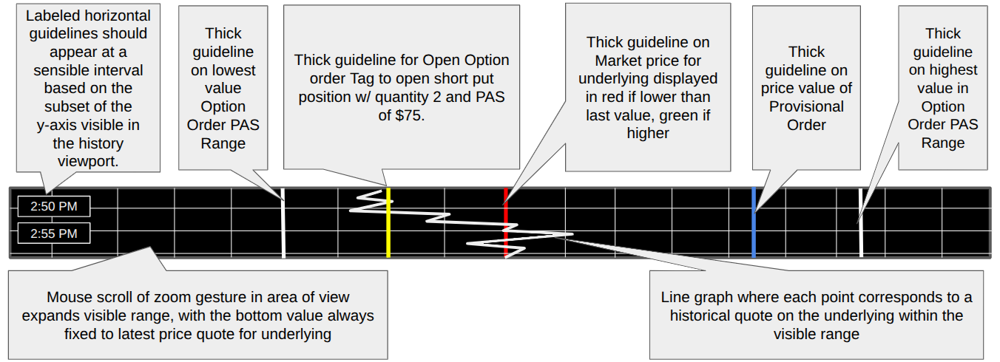
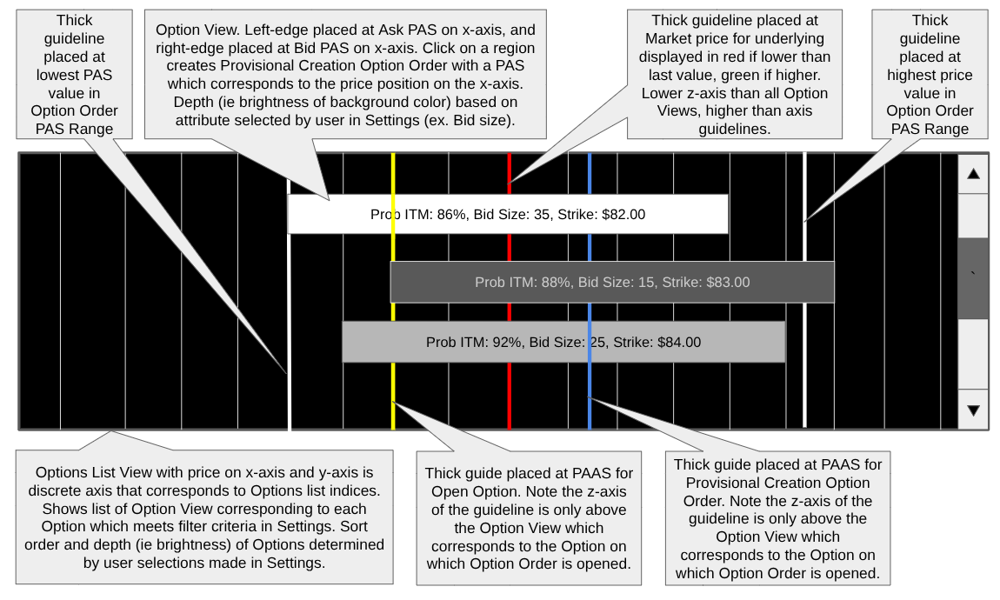

# Exvest Product Specification

## Terms and definitions

* Option: in the context of this document, an Option is assumed to refer to a Put option with a strike price.  
* In-the-money (ITM): a state in which an Option’s strike price is higher than the underlying’s price.  
* Quote: A Price for a  security at a specific date/time.  
* Probability ITM: The probability that a put option will expire ITM.  
* Purchase-by-assignment strategy (PBAS): a strategy in which an investor attempts to purchase shares of a security by opening a short put position they expect to expire ITM, and being subsequently assigned the shares.  
* Price-per-Assigned Share (PAS): the effective price of each share assigned to an investor as a consequence of a put option they sold being exercised. This value is computed by taking the strike price of the put option, subtracting the premium the investor was paid, and adding the commission.  
* Option Bid PAS: The PAS the investor would receive if they sold a put option at its current Bid price, and the option was subsequently exercised.  
* Option Ask PAS: The PAS the investor would receive if they sold a put option at its current Ask price, and the option was subsequently exercised.  
* Option Order: in the context of this document, an Order to open a short put position on an option. Every Option Order is associated with a put option, and has a limit price and quantity.  
* Open Option Order: An Option Order which has yet to be filled.  
* Min Order PAS: the smallest possible PAS for a new Option Order which the user can cover on any of the set of available options that meet their filter criteria, given that an order on an option must provide a PAS larger than or equal to its Option’s bid PAS.  
* Max Order PAS: the largest PAS for an order to open a short put position which the user can cover on any of the set of available options that meet their filter criteria using their available liquidity, given that an order on an option must provide a PAS smaller than or equal to its Option’s ask PAS.  
* Option Order PAS range: the range of price values between the Option Order Min and Max PAS.   
* Price per Assigned Share Savings (PASS): The difference in the Price per Assigned Share of an order to open a short put position on an underlying and the current market value of the underlying.  
* Provisional Option Order: A provisional which describes the creation or modification of an Open Option Order which have yet to be committed:  
  * **Provisional Creation Option Order** (PCOO): a  description of how to create an Open Option Order on a put option.  
  * **Provisional Modification Option Order (PMOO)**: A description of how to modify an existing Open Option Order.  
* Available Funds: The funds the user has left in the selected account, not including the funds required to cover the cost of purchasing the shares they are obligated to purchase by the put options they have either sold or have Open Option Orders to sell.   
* Liquidatable assets: a list of securities which the app will automatically liquidate in order to generate enough available funds to cover an Open Option Order.  
* Available liquidity: Available funds \+ market value of liquidatable holdings in the current account. This value is dynamically updated as the market value of the liquidatable assets fluctuates.

## Achieving low-cost diversification as a US expat residing in the EU

The Exchange Traded Fund (ETF) is one of the most tax and fee-efficient ways for retail investors to diversify their portfolio.  Retail investors residing in the US can purchase shares of US ETFs on an exchange. However US citizens who reside in the EU are subject to the Packaged Retail and Insurance-based Investment Products (PRIIPs) regulation, which mandates that the fund manufacturer provide a Key Information Document (KID) before shares of their fund can be sold to an EU investor. Unfortunately **most US ETFs do not provide the KID mandated by PRIIPs, and therefore can not be legally purchased by US citizens who reside in the EU**.

A common alternative for EU residents who want to diversify is to purchase shares of an Undertakings for Collective Investment in Transferable Securities (UCITS) fund, which provides a KID. However most UCITS funds are considered Passive Foreign Investment Companies (PFICs) by the IRS, which are taxed punitively by the IRS when US expats file their taxes.  Furthermore UCITS funds typically have higher fees than equivalent US ETFs. Consequently the **PRIIPs regulation increases the cost of diversification for US citizens residing in the EU**.

Thankfully US citizens resident in the EU have a legal path to acquire shares of US ETFs: the Purchase-by-Assignment Strategy (PBAS). This strategy involves opening covered short put positions on shares of an ETF which are likely to expire ITM, and being subsequently assigned shares of that ETF. The put options are typically sold within hours of their expiration to reduce the risk of significant divergence between the underlying price and the Price-per-assigned share (PAS) at the end of the trading day. The PBAS is PRIIPs-compliant, because the exchange provides a KID for each put option contract sold on the exchange. When the seller of the put option subsequently fulfills their obligation to purchase shares of the ETF, this trade is considered part of the original transaction covered by the KID. Consequently **the PBAS offers US expats residing in the EU a legal path to low-cost diversification**. 

## Efficient execution of the PBAS

In order to efficiently execute the PBAS, an investor must optimize several (often competing) objectives: 

* Minimize the PAS of an Option Order, ideally below the current price of the underlying to compensate the investor for the risk of a decline in underlying value prior to market close. The investor may attempt to price their put options more aggressively if they identify that the price of the underlying is trending down, because buyers may be more incentivized to hedge (i.e. higher bid sizes, orders filled closer to ask, etc). Conversely, the investor may be forced to accept a higher PAS when the price of the underlying is trending up.  
* Maximize the probability that their Open Option orders will be filled prior to expiration at the end of the trading day. This typically involves bidding on options with higher bid sizes, or choosing a PAS that results in a limit premium price closer to an option’s bid price.  
* Maximize the likelihood that the put option be exercised by opening short put positions on options with higher strike prices. Note that even if a put option expires ITM, the purchaser of the option may still choose not to exercise before 5:30PM EST if after-hours news (like earnings announcements) lead them to believe that the price of the underlying will rise. Consequently, the seller of the put option might be further incented to go deeper in the money on days when known after-hours events (ex. earnings, jobs reports, fed meetings) might increase volatility of the underlying price immediately after-hours.

## Problem: Typical brokerage options UX is suboptimal for executing PBA

Most online brokerages show the user an options chain sorted by strike price. To create an order to open a short put position, the user must select an option with a strike price and specify a limit price for the option premium they will accept (typically between the bid and ask). This UX is suboptimal for executing the PBAS for a variety of reasons:

* Shows both call and put options, even though the user is only interested in opening short put positions.  
* Shows all options in the chain, when the investor is only interested in options which meet a minimum probability ITM threshold.  
* Displays and accepts option premium prices (bid, ask, limit), despite the fact that the investor is only interested in the Price Per Assigned Share (PAS) resulting from a given premium. As a result, the investor must constantly manually calculate the PAS  in order to calculate its proximity to the changing price of the underlying. This in turn slows the rate at which the user can adjust premium limit prices in response to changing market conditions.  
* Although the current price of the underlying is typically shown, most brokerage platforms do not show a chart showing recent movements in the price of the underlying alongside the options chain. Consequently the user may miss trends which might have otherwise led them to adjust the price of their open Option orders. 

## Exvest: an app Optimized for execution of PBAS

The Exvest interface is divided into clearly delineated regions that allow investors to evaluate and act on short put opportunities using the Purchase-by-Assignment (PBA) strategy. The UX is structured to surface only the most relevant information—specifically Price-per-Assigned Share (PAS) values, bid sizes, strike prices, and the probability of expiring in-the-money (ITM). In contrast, option premium information is prominently displayed to the user and is calculated automatically from the PAS when Option orders are placed. The layout supports intuitive comparison and interactive option order placement and adjustment.

### Constraints  {#constraints}

Note that no [Operation](#operations) can successfully complete if it puts the app in a state which does not minimally satisfy the following constraints: 

* Every saved Option Order’s price limit must be at a step interval allowed by the Option  
* Every saved Option Order’s bid Price must be smaller than or equal to that Order’s price limit which must be smaller than or equal that Option’s ask price  
* The cash required to cover all Open Option Orders must be smaller than or equal to the available funds in the selected account.  
* The cash required to cover all Open Option orders and Provisional Option Orders must be smaller than or equal to the available liquidity in the selected account.  
* Only one Provisional Option Order (of any type) can be saved at once.  
* The quantity of an Order must be one at a minimum.

### Operations  {#operations}

This section outlines a (non-comprehensive) set of operations which the user can initiate or the app can initiate independently.  

#### Create and Save a PCOO on an Option with a desired PAS {#create-and-save-a-pcoo-on-an-option-with-a-desired-pas}

An attempt to create a PCOO can be made by specifying a desired PAS for a Put Option. After the PCOO is created, it is associated with the user's intended Put option, and the quantity of the order is set to one, the app attempts to [update the Option Order to the desired PAS](#update-a-provisional-option-order-to-a-desired-pas). If the update succeeds, the PCOO is saved. Otherwise if the update Operation fails for any reason (ex. insufficient funds) the PCOO is discarded, and this operation fails.

#### Create and save a PMOO with a desired PAS {#create-and-save-a-pmoo-with-a-desired-pas}

This operation attempts to create a PMOO by specifying an existing Open Option Order and a new desired PAS. This operation creates a PMOO associated with the Open Option Order, sets the quantity to the same value as that of the Open Option Order, and then attempts to update the PMOO to the desired pas. If the update succeeds the PMOO is saved. Otherwise if the update operation fails for any reason (ex. Insufficient

#### Update a Provisional Option Order to a desired PAS {#update-a-provisional-option-order-to-a-desired-pas}

Provisional Option Orders do not store PAS values, but rather limit price and quantity. An Option Order’s Actual PAS can be calculated using the following equation: ((strike \- limit\_price) \+ commission). It may be impossible to update an Option Order such that it precisely provides the desired PAS while also satisfying the App Constraints. However when there is an attempt to update a Provisional Option Order to a desired PAS the app should endeavor to update the Option Order to an actual PAS which is as close to the desired PAS as possible.

The app starts by attempting to calculate the price limit which minimizes the difference between the Desired and Actual PAS, while bounding the price to satisfy the App [Constraints](#constraints). 

If the app finds a price limit which satisfies the constraints, it should check if the user has enabled the “Automatically update Option Order quantity to highest value which can be purchased with available funds” setting in the [Order Settings](#order-settings). If so, it should attempt to maximize the quantity subject to the aforementioned constraints. Then the app should update the Option Order with the calculated price and quantity.

Alternatively if the app was not able to find a valid price limit value, the app should attempt to lower the Order quantity to the highest non-zero value which satisfies all the [Constraints](#constraints). 

If no combination of values for quantity and limit can be found which satisfies these constraints, the update operation fails. Alternatively the price and limit of the Provisional Option Order are updated and the operation succeeds.

#### Create Open Option Order w/ price and quantity  {#create-open-option-order-w/-price-and-quantity}

This operation is provided by the brokerage API, and may fail.

#### Update Open Option Order to a new price and quantity {#update-open-option-order-to-a-new-price-and-quantity}

This operation is provided by the brokerage API, and may fail.

#### Update Provisional Option Order to a Desired Quantity {#update-provisional-option-order-to-a-desired-quantity}

This operation is executed when a user attempts to change the quantity of a PO. However due to app [constraints](#constraints), it may not be possible to update a PO with a given desired quantity. Instead, the app will attempt to minimize the difference between the desired and the actual quantity value assigned to the PO. However the quantity value should be bounded such that the [Constraints](#constraints) are satisfied. If a quantity value is found which satisfies all constraints, the app should attempt to update the Option Order to this actual quantity value.

#### Generate desired available funds by selling liquidatable securities {#generate-desired-available-funds-by-selling-liquidatable-securities}

This operation attempts to generate available funds which exceed the desired amount of available funds by as little as possible by concurrently [opening orders to sell quantities of various liquidatable assets in the currently selected account at market value](#open-an-order-to-sell-a-quantity-of-a-security-at-market-price). The funds which are expected to be in the user's account if all of these orders is referred to as the expected funds. However the market price of an asset may fluctuate before an order is filled, and the actual funds generated by an order may be lower than expected. In these cases the app may need to compensate by opening additional orders to ensure the desired funds are available. At any point if the market value of liquidatable securities is smaller than the remaining desired funds, the operation should fail. Failures to open orders to sell liquidatable assets should be retried which are the responsibility of the server should be retried no more than three times. Failure to open the same order three times should cause the entire operation to fail.

#### Commit a PCOO {#commit-a-pcoo}

This operation first checks whether there is sufficient available funds to commit a PCOO. If not the app attempts to [generate the available funds by selling liquidatable securities](#generate-desired-available-funds-by-selling-liquidatable-securities). If this sub operation fails, the entire operation fails for the same reason. However, if sufficient available funds are generated, [an attempt is made to create an open option order with the limit price and quantity of the PCOO](#create-open-option-order-w/-price-and-quantity). If this attempt fails, the error is displayed to the user in a modal dialog. Once the message is acknowledged, the PCOO is deleted.

#### Commit a PMOO {#commit-a-pmoo}

This operation first checks whether there is sufficient available funds to commit a PMOO based on the difference between the associated open orders current PAS and the desired PAS. If not the app attempts to [generate the available funds by selling liquidatable securities](#generate-desired-available-funds-by-selling-liquidatable-securities). If this sub operation fails, the entire operation fails for the same reason. However, if sufficient available funds are generated, an attempt is made to [update](#update-open-option-order-to-a-new-price-and-quantity)   
[the associated order with the PMOO’s price and quantity](#update-open-option-order-to-a-new-price-and-quantity). If this attempt fails, the error is displayed to the user in a modal dialog. Once the message is acknowledged, the PCOO is deleted.

#### Open an order to sell a quantity of a security at market price {#open-an-order-to-sell-a-quantity-of-a-security-at-market-price}

This operation is provided by the brokerage API and may fail.

#### Attempt to cancel an open order {#attempt-to-cancel-an-open-order}

This operation is provided by the brokerage API and may fail.

### Views

The root App View is composed of several views stacked on top of each other:

1. [Header](#header)  
2. [Price Axis](#price-axis) Labels  
3. [Split view](#split-view:-dual-region-layout) (expands to use all remaining vertical space)   
4. [Price Axis Controller](#price-axis-controller)

In order to reduce eye strain the background of all views should be black, and all text should be light gray unless stated otherwise.

Initially only the Header view is displayed. The Header contains an autocomplete search box which is used to look up a security. Once a security is found, data for that security is fetched to load and display the other views.

The App view also overlays a [Settings view](#settings-view) in a floating pop-up window when the user toggles the Settings button in the Header. 

#### Header {#header}

This view allows the user to select an account and security on which to open short positions and shows useful contextual information about both.

* Fixed-height region pinned at the top of the interface  
* Displays the following views left to right:    
  * Account selection drop down list. Each entry displays the last four digits of the account as well as the name of the account (if present). Defaults to the first of the user’s accounts.  
  * Settings button which toggles the visibility of the [Settings View](#heading=h.eoedxn19jj43) in a pop-up window   
  * Autocomplete Search text box for looking up a symbol (initialized to last valid value in last app session and selected automatically onload).  
  * Available liquidity in the selected account.   
  * **Countdown timer** showing time remaining until market close (hh:mm:ss)

#### Price Axis {#price-axis}

 

This control is responsible for displaying a range of a Price x-axis along its full horizontal width. The range of the Price axis displayed is controlled by the [Price Axis Controller](#price-axis-controller) view. 

This view displays the following visual elements furthest away to closest to the user depth-wise:

* Axis guidelines at regular intervals based on the available screen real estate and the range of x-axis values being displayed. These guidelines are rendered in a dark gray to minimize visual clutter.   
* Labels on a fixed interval of x-axis guidelines which show the price at that position in the axis. The interval should be large enough to ensure the labels do not overlap. Labels are rendered in the same color as axis guidelines.  
* [Tags](https://drive.google.com/open?id=0B7zweKma2uL1SGZqaGFtT1gtX0k&resourcekey=0-rhDpf8-A20uWeaRa_NRXdQ) for the prices of the following objects from furthest to closest depth including…  
  * Two [Static tags](#static-tag) showing the Min and Max PAS for the filtered list of options displayed in the [Options List view](#options-list). Each Tag should be in a noticeably brighter color than those used for axis labels/grid lines.  
  * An [Option rder Tag](#option-order-tag) in [Open mode](#heading=h.2lodx2nevfk6) for each Open Option Order without an associated PCOO, placed at the PAS of the associated Open Option Order.  
  * An [Option Order Tag](#option-order-tag) in [Provisional Mode](#heading=h.g1rdlo4ts5kp) placed at PAS of the Provisional Option Order.

##### Tags {#tags}

Like Axis labels, Tags label specific price values have guidelines. However tag labels are rendered in a pennant shape, and their guidelines are twice as thick as the guidelines for labels. 

The outline of a Tag’s pennant, its label text, and its guideline should all share the same color. By default, Tags have the same color as the color of guidelines. There are two types of tags: 

1. Static tag   
2. Option Order Tag

The guideline for an Option Order Tag is always rendered at the same depth as the Option Order Tag. Option Order Tags are rendered on top of static tags.

###### *Static tag* {#static-tag}

A static tag simply displays a price value and introduces a guideline there. The color of a static tag is the same as a grid line by default, but can be overridden.

###### *Option Order Tag* {#option-order-tag}

An Option Order Tag has two modes:

* Open   
* Provisional

Tags in Provisional mode are rendered on top of tags in Open mode.

In both Open and Provisional Mode, a Tag in shows the quantity and PAS for an associated Open Option Order (“ex. 2 x $32.55”). In Open Mode the tag color is yellow, and in Provisional Mode it is blue.

An Open Option Order Tag corresponds to an Open Option Order, whereas a Tag in Provisional Mode is associated with a Provisional Option Order.  
A trash icon appears on the right of the text within a Tag in Open Mode. Clicking on the trash icon causes the app to [attempt to cancel the Tag’s associated Option order](#attempt-to-cancel-an-open-order), after prompting the user for confirmation in a dialog.

Initiating a drag operation on a Tag in Open Mode causes the app to attempt to [create and save a PMOO associated with the Tag’s Open Order at the PAS](#create-and-save-a-pmoo-with-a-desired-pas) implied by the x drag position on the [Price Axis View](#price-axis). If the operation is unsuccessful, the user is shown a modal dialog indicating the reason for failure. Otherwise if the operation is successful the Tag switches to Provisional Mode and shows the price and quantity information for the created PMOO instead of the Open Order. Each subsequent drag event on the Tag causes the app to attempt to [update the PAS of the PMOO](#update-a-provisional-option-order-to-a-desired-pas) corresponding to the positional of the drag event on the horizontal position of the [Price Axis View](#price-axis). Ending the drag operation causes the app to attempt to [commit the PMOO](#commit-a-pmoo). If this operation is unsuccessful, a modal dialog is shown to the user explaining the reason. After the operation is complete the Tag once again becomes associated with the Original Open Order and switches back to Open Mode.

#### Split view: Dual Region Layout {#split-view:-dual-region-layout}

The Split view is split into two vertically stacked views. 

1) [Historical price chart](#historical-price-chart)  
2) [Options List](#options-list) 

Between these views there is a vertical slider which the user can drag to give proportionally more of the available vertical space to one control or another.

##### Historical Price Chart {#historical-price-chart}

This view is intended to show the price movement of the underlying to better inform the user about which Option orders are more likely to be filled. For example if the price of the underlying is trending down, an investor may attempt to open a short put position with a lower PAS, because it may be more likely there's an investor on the other side of the trade willing to pay a higher premium to hedge against further downside volatility.

This view plots historical prices for the underlying with time on the y-axis and prices on the X-axis.  Each point is connected to the previously rendered point by a line.

* X-axis is price (range determined by [Price Axis Controller](#price-axis-controller)). The view plots vertical guidelines along the x-axis in the same position as they are rendered in the Price Axis View (note this includes guidelines for the [Tags](#tags) as well). The guidelines continue vertically from the top to the bottom of the region of this view, giving the appearance that the guidelines in the Price Axis View cross vertically into this view.  
* The Y-axis is time with the smallest values at the top and the largest values at the bottom. The last value in the visible y-axis range is always the timestamp in the most recent quote received for the underlying. The visible range size of the axis is fixed, but user-adjustable. Consequently, as time goes by the points corresponding to earlier quotes on the chart drift upwards and out of the visible range. Consequently old price quotes which no longer fit in the range of y-axis disappear off the top edge of the view with the passage of time. The smallest possible value that can be displayed on the y-axis is the timestamp in the oldest quote available on the current trading day. The size of the range of the y-axis defaults to 30 mins, but is adjustable using the mouse scroll wheel. The minimum displayed range in the y-axis is 5 minutes. 

##### Options List {#options-list}

This view renders [Option Views](#option-view) for Options associated with the selected underlying security along the following axes:

1. Prices plotted on the x-axis with a visible range controlled by the [Price Axis Controller](#price-axis-controller). The left edge and right edge of an Option View is placed on the x-axis at its Ask and Bid PAS respectively. Note this may mean that some Put Options Views are not visible within the visible range of the Price axis rendered by this view. This view renders all guidelines (including Tag guidelines) in the [Price Axis](#price-axis) and [Historical Price Chart](#historical-price-chart) at the same position along the x-axis, creating the impression of vertically continuity across all these views.   
2. Discrete list indices plotted on the y-axis, with each index corresponding to a put option in a list filtered and sorted based on user-configured [Options List Settings](#options-list-settings). Put option views must be rendered at least 20 pixels high, and should have at least 10 pixels of margin for a total of 30 pixels of minimum horizontal distance between indices on the y-axis. There are no grid lines along the y-axis.  
3. Depth based on user-selected criteria specified in the [Options list filtering and sorting rules](#option-list-filtering-and-sorting-rules). Note that setting a depth on an Option View simply changes the brightness of its background color, with darker colors giving the appearance of being further away (ie lower depth).

In terms of z-axis rendering, all non-Tag price axis guidelines should be rendered furthest away. Next closest should be Order Tags guidelines and Option Views. These should be interspersed such that a guidelines for an Order tag is only rendered on top of the [Option View](#option-view) which corresponds to the Option associated with the Order,  and below all other Option Views. This makes it visually clear which Order is placed on which Option.

The y-axis should have a vertical scroll bar if all Options can not be fit in the visible horizontal viewport. However there should never be a horizontal scrollbar as the visible range of the x-axis should be controlled by the [Price Axis Controller View](#price-axis-controller).

###### *Option List Filtering and Sorting Rules* {#option-list-filtering-and-sorting-rules}

The list of Put Options is filtered and sorted based on the rules defined in the [Options List settings](#options-list-settings). However there are some exceptions to these rules:

* Options with associated Provisional Orders are never filtered out from the list even if their Probability ITM falls below the threshold. Instead their Option View is disabled, which means no new open or Provisional Option Orders can be created on the option and existing ones can only be deleted.  
* The position of Put options w/ Provisional Option Orders is not changed in the list until the Provisional Option Order has been deleted or switched to an Open Option Order. This is to prevent the Put Order from moving around while the user is interacting with it. The implication is that the list may be sparse at certain times, or that items may not always be strictly ordered by bid size in certain situations. Note however that Put Options with only Open Option Orders can be re-ordered in the list.

###### *Option View* {#option-view}

An Option View is a rectangle which represents a Put option on which a user can open a short put position. The Depth (not the same as the z-axis) of an Option View can be set to a decimal value between 0 and 1, which changes the background color to a grayscale color from black to white. The following text is displayed within an Option View:

* Probability ITM  
* Ask PAS  
* Bid Size  
* Bid PAS

Text foreground color is adjusted to ensure text is legible as the background color is changed.

An Option View can be disabled, which causes its background color to change to a shade between black and red based on the Option View depth. When a put option is disabled it is not possible to open new orders on that option.

Initiating a drag operation on an Option view causes the app to attempt to [create and save a PCOO on the associated Option](#create-and-save-a-pcoo-on-an-option-with-a-desired-pas) with a PAS corresponding to the x-position of the drag event on the price axis of the [Options List view](#options-list). If the user drags horizontally the app attempts to [update the PCOO PAS](#update-a-provisional-option-order-to-a-desired-pas) to the price value corresponding to the x position of the drag event. When the user ends the drag operation the app attempts to [commit the PCOO](#commit-a-pcoo). When the user drags up or down also the app attempts to [increment the quantity of the Provisional Option Order](#update-provisional-option-order-to-a-desired-quantity) with a movement in the y-axis of 5% of the total height of the Put Options View view corresponding to a change of one in the quantity. The minimum quantity is 1, but the maximum quantity multiplied by the PAS cannot exceed the user’s remaining Available Funds.

#### Price Axis Controller {#price-axis-controller}

 

This view allows the user to change the range of the price x-axis displayed in the following surrogate views: [Price Axis](#price-axis), [Historical Price Chart](#historical-price-chart), and the [Options List](#options-list). The entire length of the view corresponds to a fixed region of the price axis from $0.00 to 2 × the price of the underlying in the most recent quote received by the view when initially rendered. This range is never updated afterwards, regardless of changes in the underlying price. The view contains a smaller, different outlined Viewport rectangle which corresponds to the visible subset of the fixed axis visible in the surrogate views. Expanding the width of the Viewport view to the left decreases the smallest price value in the range visible in surrogate views, and expanding the width to the right increases the number of views visible in the other views on the right of the price axis. Expanding/contracting the size of the Viewport can be done using the mouse wheel, or by dragging sliders on the left and right edges of the viewport view. In addition to expanding the viewport view, the user can move the viewport view to a different region of the axis while preserving the range size. This can be done by dragging in the viewport and dragging left and right.

All vertical Tag guidelines are rendered at the appropriate transposed x-position of the Price Axis Controller based on its (expanded) Range. For example if there is a Tag at $50, and the range of values in the Price Axis Controller is 0-200, the Tag guideline should be rendered vertically at 100px. Note that the same Tag guideline may be rendered at a different position in the surrogate views, because their axis range may be different. The Tag guidelines should be visible in the Viewport view as well.

#### Settings View {#settings-view}

This view enables the user to configure several options. If possible these options should be persisted across app loads. 

##### Order Settings {#order-settings}

* Select source of available funds, with the following options:   
  * Cash  
  * Cash \+ Limited Margin (default)  
  * Cash \+ Margin  
  * Cash \+ \<currency value\> of Margin  
* “Liquidatable assets” This is a list of securities the user can select from their holdings across all accounts. These assets will automatically be liquidated at market value in order to generate sufficient available funds to cover Open Option Orders. In order to minimize the chances of poor execution, these funds should either be cash equivalents or highly-liquid (money market funds, heavily-traded ETFs, etc).  
* Automatically update Order quantity to highest value which can be purchased with available funds? (Defaults to no)  
* Projected Commission per Option contract sale (defaults to $0.75)  
* Cancel all other orders whenever an order is filled (Default is no)

##### Options List settings {#options-list-settings}

* “Filter Options with Probability ITM less than \<user configurable percentage value which defaults to 80%\>”  
* Filter options with bid sizes smaller than or equal to \< defaults to 1\>  
* “Sort Put options by…” with options including…  
  * Bid size (descending)  
  * Proximity of Bid PAS to Underlying price (ascending)  
  * Probability ITM (descending)  
* “Option depth reflects” with options including…  
  * Bid size (descending)  
  * Proximity of Bid PAS to Underlying price (ascending)  
  * Probability ITM (descending)

